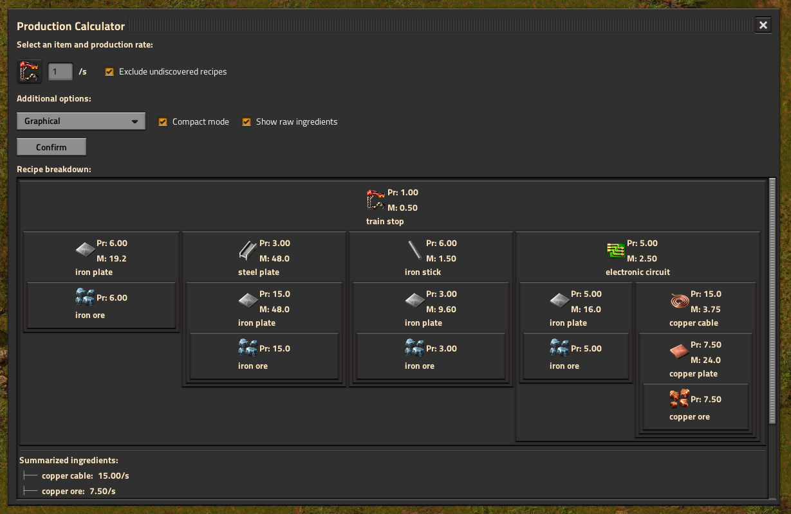
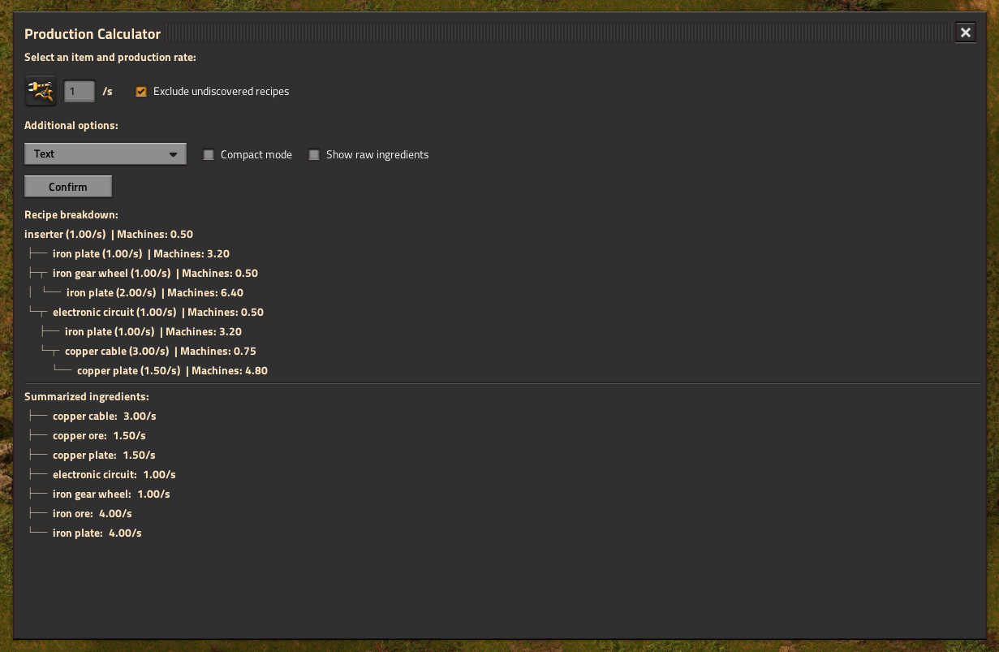

# Factorio Resource Calculator Mod

## Overview

**Factorio Resource Calculator** is a mod for Factorio that helps to calculate the resources and number of machines required for production lines. With a GUI, you can select any item, specify a desired production rate, and instantly see the breakdown of ingredients, machine counts, and production rates in both text and graphical tree formats.

## Features

- **Production Calculator GUI:** accessible with a button in the top-right of the screen or `Ctrl+c` hotkey.
- **Item Picker:** Select any item to calculate its production requirements.
- **Production Rate Input:** Specify the production rate in number of items per second.
- **Recipe Filtering:** Option to exclude undiscovered recipes.
- **Compact & Raw Ingredient Modes:** Toggle between compact display and hiding raw ingredients (ones without their ingredients).
- **Tree Display Modes:** View requirements as a text tree or graphical tree.
- **Summarized Ingredients:** See a summary of all required ingredients per second.

## Usage

1. Click the **Open Calculator** button in the top-right GUI or press `Ctrl+C`.
2. Select an item and enter the desired production rate.
3. Select the production mchines you're using.
4. Adjust additional options as needed:
   - Exclude undiscovered recipes
   - Compact mode
   - Show raw ingredients
   - Choose tree display mode (Text/Graphical)
5. Click **Confirm** to view the resource breakdown.

## Installation

1. Clone this repository into your Factorio `mods` folder.
2. Ensure you are running Factorio version 2.0 or higher.
3. Enable the mod in the Factorio mod manager.

## Compatibility

- Requires Factorio version **2.0** or higher.
- No mod dependencies.

## Credits

- **Author:** PikkiKaju

## License

This mod is provided as-is for personal use in Factorio. Please respect the Factorio modding guidelines and do not redistribute without permission.
